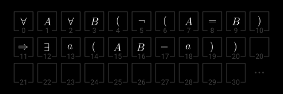
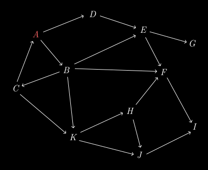

> [!art_title]
> # Introduction

It was around the age of 33 that I began to study mathematics. The reason for this was that during that time, I purchased a beautiful book by Taschen, which was a copy of Euclid's *Elements*. The layout and graphic design of the book was stunning, and this was why I brought it. However, as I began to read the text itself, I came to realize why this book was worth being designed in such a way.

I spent some time reading through the book and reproduced all of the propositions using straightedge and compass. However, rather than proving the propositions, I was more interested in how Euclid gave his definitions. I must admit that I found some of his definitions difficult to understand, such as the definition of straight lines. In my opinion, Euclid did not make it clear in what method a set of points can be arranged into a straight line. Similarly, I was confused by the definition of points. Euclid suggested that a point is an object which has no parts, but void has no parts either. To me, this definition only explains a property of points but not the meaning of "being a point". Furthermore, what does he mean by "parts"?

In the following years, as a leisure activity in life, I aimlessly studied various university-level mathematics courses, including some important branches of mathematical analysis taught by the mathematics department. However, I had little interest in applying this knowledge and my primary passion remained in attempting to explain the reasonableness of these definitions.

## Primitive notions

During those years, I occasionally pondered on the definitions of points and lines in *Elements*, but couldn't find any satisfactory answers. I tried to define points and lines using set theory. This was an effective method, but then, how does one define the concept of sets? I wrote many drafts and notes on this, but always ended up with a set of circular definitions - which was truly frustrating.

I found solace in the spring festival of 2023 when I read Hilbert's *Foundations of Geometry* (*Grundlagen der Geometrie*). In this book, Hilbert reconstructed the definitions and axioms of *Elements* from a modern perspective. Although there is a broad overlap between *Elements* and the *Foundations of Geometry* in terms of conclusions, I found the latter to be far more interesting.

Hilbert's solution to the "gaps" in the definitions of *Elements* was to accept certain geometric objects as **primitive objects**, i.e. to accept these objects' concepts without formal definitions. These objects are: **points**, **lines**, and **planes**. Accepting these undefined concepts means that these concepts are assumed to be defined - just not formally interpreted within the context. Therefore, the existence of the objects referred to by these concepts (points, lines, and planes) is the initial hypothesis of the theory, which can be understood as the "axioms" that are not explicitly stated in the theory. In addition, he also gave a set of binary relations on primitive objects: **betweenness**, **inclusion**, and **congruence**. These binary relations are also undefined and therefore are the **primitive relations** of the theory. These three primitive objects and relations together form a set of **primitive notions** (also called **primitive concepts**) of Hilbert's axiomatization and serve as the starting point of the theory. Through a set of geometric axioms, all structures of Euclidean geometry can be defined in terms of these primitive concepts.

If we introduce first-order logic, using six predicates to represent Hilbert's six primitive notion, we will see a beautiful picture: the entire Euclidean geometry can be clearly described using these symbols. For example, if we use capital Latin letters $A, B, C, \ldots$ to represent points, lowercase Latin letters $a, b, c, \ldots$ to represent lines, and use capital letter pairs, say $AB$, to represent the line containing $A$ and $B$, and use the equal sign $=$ to represent the congruence relation, then Hilbert's Axiom 1, which states that two points determine a line, can be written as:

> [!figure]
> 
> 
> In words, Two distinct points always completely determine a straight line.

To make it clear that formal logic is built upon a certain writing process (just like what we did in "Minecraft"), I specially use boxes with natural number indices to represent placeholders for symbols - you can think of this system of placeholders as the space of formal language.

However, you may ask whether it is necessary to compromise by accepting some undefined concepts in a theory. If not, then my peace of mind on this matter seems as unbearable as some people accepting injustice as a social norm.

However, a simple fact that surprises many people is that **we cannot define all concepts in any theory**. That is, the existence of primitive concepts is an unavoidable fact in logic. You can imagine that there are a certain number of concepts in any theory. We can regard these concepts as points, $A, B, C, \ldots$. If we link two concepts $A \to B$ with a one-way arrow, representing the process of $B$ being defined in terms of $A$, you will soon find that if you attempt to define all concepts, there will always be circular definitions between two concepts.

> [!figure]
> 
> 
> 
> In this diagram, concept $A$ is circularly defined, as $A \to B \to C \to A$.

Furthermore, if we want to avoid circular definitions, we inevitably face an infinite definition process. This is why we must accept the existence of primitive notions. Of course, there is a way to check whether a concept is redundant in the set of primitive concepts: no primitive concept should be able to define any other primitive notions.

On the other hand, just as any injustice has its limits, the selection of primitive notions is not random. The primitive notions we choose should never be the concepts that easily spark controversy once they lack explanation in terms of simpler concepts. However, this standard cannot be assessed logically - it is more like a product of aesthetics.

## Axioms

A similar situation to the existence of primitive notions is the existence of axioms in every formal theory. This was initially proved by Kurt Gödel in his first incompleteness theorem published in 1931. Ironically, Gödel's subsequent second incompleteness theorem, which states that no theory can prove its own consistency, also shows that the consistency of the axiomatization in which Gödel's incompleteness theorems are located cannot be proven by the theory itself. However, despite this, we still tend to believe that what Gödel said is indeed a truth. This may be due to our trust in Gödel's fame, but more importantly, the axioms behind the derivation of these two theorems (including Peano's axioms for natural numbers) are too obvious - although they cannot be proven without producing any new axioms - so, doubting Gödel's incompleteness theorems is essentially doubting the axioms themselves. No one says we can't, but we tends to believe in them.

Here, what I see, in addition to the limitations of formal theory, is more of the existence of something beyond the realm of logic.

## Definitions

Definitions are explanations of concepts, so they are not statements that carry any truth value. Any definition is described in terms of primitive concepts in the theory. It looks more like an idea for reducing length and increasing readability, similar to how programmers encapsulate program fragments for easier maintenance. Therefore, theoretically, a theory can be completely introduced without any definitions. This is indeed the case. However, an often overlooked fact is that **once we define a concept, it means that we accept the existence of the object or relationship explained by the definition**. And "existence" itself is a proposition that needs to be proven. This is why we say "the definition of ... is derived from (or guaranteed by) the axiom(s) of ..." - after all, any proposition is derived from some axioms. Otherwise, what we define may be something that does not exist in the universe of the theory. As Parmenides suggests: we cannot discuss things that do not exist.

In the following discussions, we will also see that, in order to define cardinal numbers, the objects that represent the sizes of sets, we would rather go through the detour of defining ordinal numbers first, and then defining cardinal numbers in terms of ordinal numbers, in order to avoid an axiom that is intuitive but lies outside the system.

---

I am delighted to share mathematical knowledge with you. In my opinion, there is nothing more enjoyable than witnessing the birth and growth of an axiomatic system. This sharing process will be long, because I hope to gradually increase and improve the foundations of all branches of mathematics that I have seen in mathematical analysis in this website. I do not expect to create anything original in this process, but I will try my best to explain it clearly. To understand these things, we must be both cautious and imaginative.

In addition, I will use natural language as much as possible to describe what I know, just like chatting while strolling in the woods.